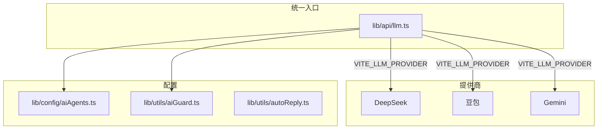

# AI 功能规范

## 架构概览

- **统一入口**：[lib/api/llm.ts](lib/api/llm.ts) 的 `generateAgentReply`，按 `VITE_LLM_PROVIDER` 分发
- **提供商**：`lib/api/llmProviders/deepseek.ts`、`doubao.ts`，以及 `lib/api/gemini.ts`
- **智能体配置**：[lib/config/aiAgents.ts](lib/config/aiAgents.ts)，含 systemPrompt、tone、maxTokens
- **防滥用**：[lib/utils/aiGuard.ts](lib/utils/aiGuard.ts)，消息长度、冷却、重复检测
- **真人模拟**：[lib/utils/autoReply.ts](lib/utils/autoReply.ts)，关键词词库

---

## 新增智能体流程

1. 在 [types.ts](types.ts) 的 `AgentType` 中增加新类型
2. 在 [lib/config/aiAgents.ts](lib/config/aiAgents.ts) 的 `AI_AGENTS` 中增加配置（含 systemPrompt、tone、maxTokens）
3. 在 [pages/Messages.tsx](pages/Messages.tsx) 的 AI 智能体入口增加卡片
4. `conversations.agent_type` 已支持任意字符串，无需迁移

---

## 防滥用规范

- **aiGuard 常量**：`MAX_MESSAGE_LENGTH`、`COOLDOWN_MS`、`RECENT_USER_MESSAGES_COUNT`
- **校验逻辑**：`shouldAllowAI(message, lastAiReplyTime, recentUserMessages)` 返回 `{ allow, fallback? }`
- **Prompt 约束**：在 aiAgents 的 systemPrompt 中附加 `ANTI_ABUSE_RULES`，要求模型对刷屏/重复内容简短回复

修改限流参数时，仅改 [lib/utils/aiGuard.ts](lib/utils/aiGuard.ts) 中的常量。

---

## 环境变量速查

| Provider | 必填变量 |
|----------|----------|
| deepseek | `VITE_DEEPSEEK_API_KEY` |
| doubao   | `VITE_DOUBAO_API_KEY`、`VITE_DOUBAO_MODEL_ID` |
| gemini   | `VITE_GEMINI_API_KEY` |

切换 provider 时设置 `VITE_LLM_PROVIDER=deepseek|doubao|gemini`，默认 `deepseek`。

---

## 个性化设定原则

- **Prompt**：专业但口语化，避免「感谢您的咨询」等模板句，单条 80 字内
- **真人词库**：口语化、带语气词，避免 AI 味；`matchWhenShortOnly` 用于「确认」类避免误匹配（如「你可以帮我做什么」中的「可以」）

---

## 参考

- 文件清单、常量、API 端点详见 [reference.md](reference.md)
