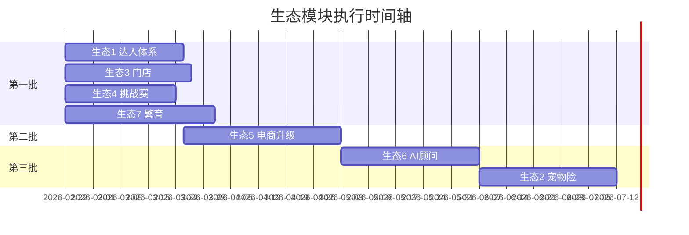

# 生态任务规范 — 完整模板与示例

> 详细模板与 mermaid 示例，供 SKILL 引用。

---

## 进度时间轴 — Mermaid 甘特图示例



---

## 进度汇报 — 完整示例

```markdown
## 生态模块进度（数据来自 tasks/_ecosystem-parallel-index.md）

| 生态 | 名称 | 状态 | 认领者 | 预计工时 |
|:---:|---|:---:|---|:---:|
| 1 | 社区宠物达人体系 | ⬜ 待认领 | - | 30h |
| 2 | 宠物险与健康保障中心 | ⬜ 待认领 | - | 35h |
| 3 | 线下门店体验中心 | ⬜ 待认领 | - | 32h |
| 4 | 宠物社群与城市挑战赛 | ⬜ 待认领 | - | 28h |
| 5 | 宠物电商与积分商城升级 | ⬜ 待认领 | - | 40h |
| 6 | AI 宠物健康顾问升级 | ⬜ 待认领 | - | 35h |
| 7 | 宠物遗传基因库与繁育系统 | ⬜ 待认领 | - | 38h |

**执行顺序**：第一批 1/3/4/7 可并行 → 第二批 5 → 第三批 6→2

**下一步**：打开 `tasks/_ecosystem-parallel-index.md` 认领生态，或阅读 `docs/prompts/agent-claim-prompt.md`
```

---

## 交付总结 — 完整示例

```markdown
## 生态 1 社区达人体系 — 交付验证

**结论**：✅ 通过

### 验收 Checklist
- [x] 用户可申请达人认证，选择等级类型
- [x] 达人拥有专栏页，展示内容与粉丝数
- [x] 粉丝可关注达人、打赏
- [x] 达人收益分成可查询
- [x] 首页有精选达人内容运营位
- [x] 未修改其他生态专属文件
- [x] types.ts 仅追加
- [x] npm run build 通过

### 验证命令
```bash
npm run build
```

### 文件清单
| 文件 | 状态 |
|------|:---:|
| lib/api/experts.ts | ✅ |
| pages/ExpertProfile.tsx | ✅ |
| pages/ExpertColumn.tsx | ✅ |
| components/ExpertBadge.tsx | ✅ |

### 后续步骤
- 在 `tasks/_ecosystem-parallel-index.md` 标记生态 1 为 ✅ 已完成
- 运行 `npm run task:mark-done` 记录（如有）
```

---

## 设计规范速查 — 完整示例

```markdown
## 生态 1：社区宠物达人体系

| 项 | 内容 |
|---|------|
| 目标 | 达人认证、专栏、粉丝、打赏、收益分成，精选内容首页展示 |
| 专属文件 | lib/api/experts.ts、pages/ExpertProfile.tsx、ExpertColumn.tsx、components/ExpertBadge.tsx |
| 共享资源 | points.ts（调用）、profiles（扩展）、petLogs（只读） |
| 验收标准 | 达人认证、专栏页、关注打赏、收益查询、首页运营位、build 通过 |
| 数据源 | tasks/ecosystem-1-community-experts/spec.md |
```
