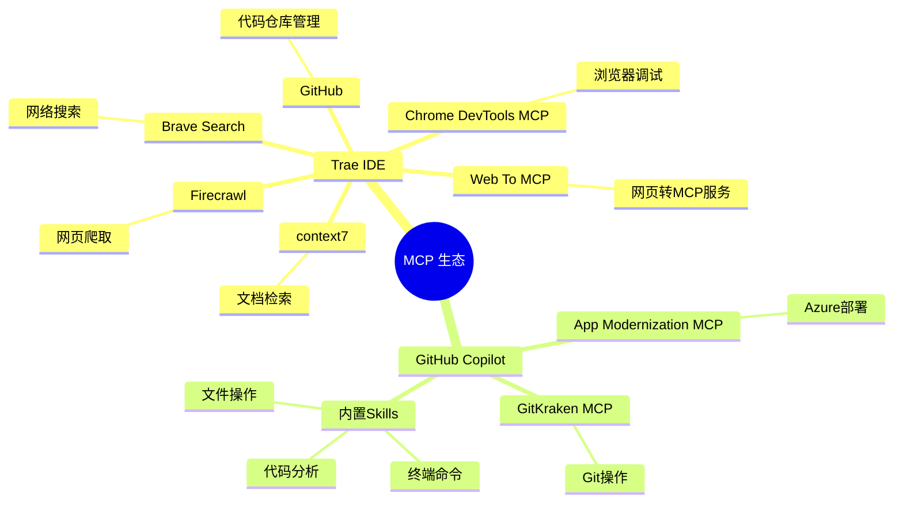
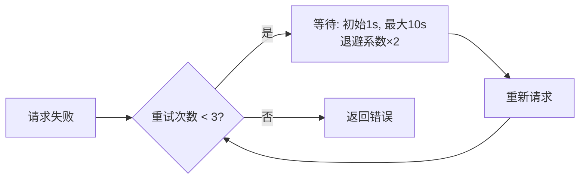
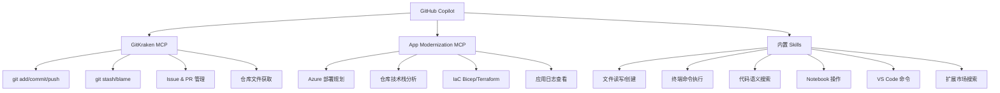
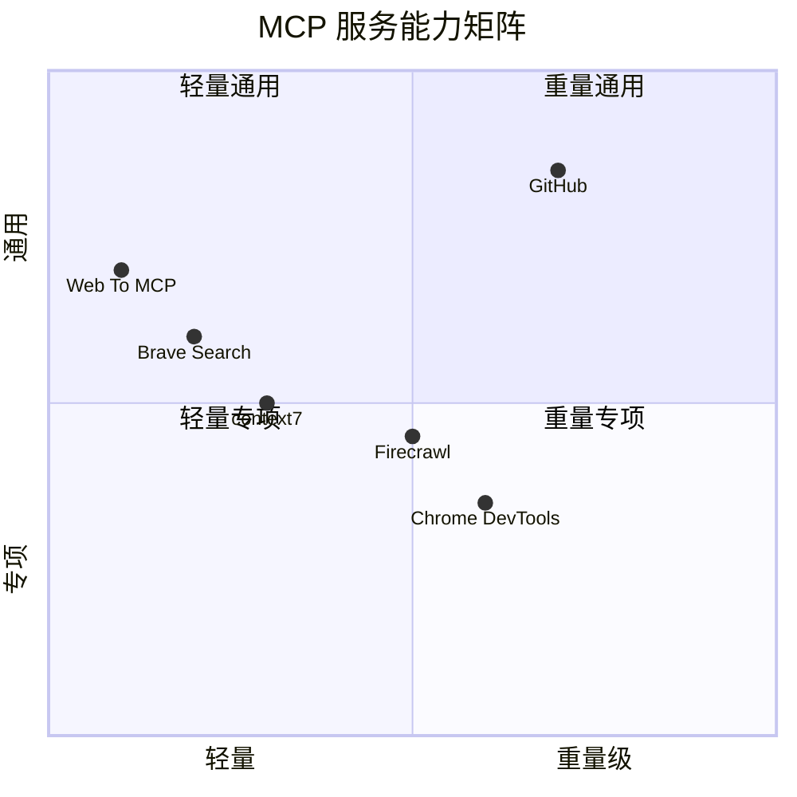

# 🔌 MCP 服务配置总览

> [!info] 什么是 MCP？
> **Model Context Protocol (MCP)** 是由 Anthropic 提出的开放标准协议，允许 AI 模型（如 Claude、GitHub Copilot）安全地连接外部工具、数据源和服务，极大扩展 AI 的能力边界。

---

## 📊 服务架构总览



---

## 🟣 Trae 配置的 MCP 服务

### 服务总览

| 图标 | 服务名 | 类型 | 核心能力 | 状态 |
|------|--------|------|----------|------|
| 🌐 | Web To MCP | URL-based | 将任意网页转为 MCP 服务 | ✅ 运行中 |
| 🔵 | Chrome DevTools MCP | npx | 浏览器调试与自动化 | ✅ 运行中 |
| 🟡 | context7 | npx | 最新文档/库上下文注入 | ✅ 运行中 |
| 🔵 | Brave Search | npx | 隐私优先的网络搜索 | ✅ 运行中 |
| 🟠 | Firecrawl | npx | 网页爬取与结构化数据提取 | ✅ 运行中 |
| 🟠 | GitHub | npx | GitHub 仓库 API 完整访问 | ✅ 运行中 |

---

### 1. 🌐 Web To MCP

> [!tip] 功能说明
> 将任意网页内容实时转换为 AI 可读的 MCP 数据，适合需要访问特定在线资源的场景。

```json
{
  "mcpServers": {
    "Web To MCP": {
      "url": "https://web-to-mcp.com/mcp/dd39ab9e-e994-456e-9cf8-861f7f4d0db7/"
    }
  }
}
```

**特点：** 无需本地依赖，直接通过 URL 接入

---

### 2. 🔵 Chrome DevTools MCP

> [!tip] 功能说明
> 连接本地 Chrome 浏览器的 DevTools 协议，支持截图、DOM 查询、网络请求监控、JavaScript 执行等调试操作。

```json
{
  "mcpServers": {
    "Chrome DevTools MCP": {
      "command": "npx",
      "args": ["-y", "chrome-devtools-mcp@latest"],
      "env": {}
    }
  }
}
```

**主要能力：**
- 📸 网页截图
- 🔍 DOM 元素查询
- 📡 网络请求监控
- ⚡ 执行 JavaScript

---

### 3. 🟡 context7

> [!tip] 功能说明
> 为 AI 注入最新、版本准确的库文档和代码示例，解决 AI 知识截止日期问题。支持 React、Vue、Supabase 等数千个库。

```json
{
  "mcpServers": {
    "context7": {
      "command": "npx",
      "args": [
        "-y",
        "@upstash/context7-mcp@latest",
        "--api-key",
        "ctx7sk-390539f8-d966-40c4-9b25-766848b92407"
      ],
      "env": {
        "DEFAULT_MINIMUM_TOKENS": "10000"
      }
    }
  }
}
```

**使用场景：** 询问特定库的 API 时，自动注入最新文档，避免幻觉

---

### 4. 🔵 Brave Search

> [!tip] 功能说明
> 使用 Brave Search API 进行实时网络搜索，隐私保护强，无追踪，适合获取最新技术资讯。

```json
{
  "mcpServers": {
    "Brave Search": {
      "command": "npx",
      "args": ["-y", "@modelcontextprotocol/server-brave-search"],
      "env": {
        "BRAVE_API_KEY": "BSA75L-IA656z9GVZA0OqV_Uw7DVBJs"
      }
    }
  }
}
```

---

### 5. 🟠 Firecrawl

> [!tip] 功能说明
> 专业网页爬取服务，支持将任意网页转为干净的 Markdown/结构化数据，支持 JavaScript 渲染页面。

```json
{
  "mcpServers": {
    "Firecrawl": {
      "command": "npx",
      "args": ["-y", "firecrawl-mcp"],
      "env": {
        "FIRECRAWL_API_KEY": "fc-922695251baf4e69bc3db8ea2eb2839c",
        "FIRECRAWL_RETRY_MAX_ATTEMPTS": "3",
        "FIRECRAWL_RETRY_INITIAL_DELAY": "1000",
        "FIRECRAWL_RETRY_MAX_DELAY": "10000",
        "FIRECRAWL_RETRY_BACKOFF_FACTOR": "2",
        "FIRECRAWL_CREDIT_WARNING_THRESHOLD": "1000",
        "FIRECRAWL_CREDIT_CRITICAL_THRESHOLD": "100"
      }
    }
  }
}
```

**重试策略：**



---

### 6. 🟠 GitHub MCP

> [!tip] 功能说明
> 通过 Personal Access Token 访问 GitHub 完整 API，支持仓库管理、Issue、PR、代码搜索等。

```json
{
  "mcpServers": {
    "GitHub": {
      "command": "npx",
      "args": ["-y", "@modelcontextprotocol/server-github"],
      "env": {
        "GITHUB_PERSONAL_ACCESS_TOKEN": "<YOUR_GITHUB_PAT_HERE>"
      }
    }
  }
}
```

**主要能力：**
- 📋 Issue / PR 管理
- 🔍 代码搜索
- 📁 仓库文件读写
- 🔔 Webhook 管理

> [!warning] 安全提示
> API Key 和 Token 属于敏感信息，不要将包含真实 key 的配置提交到公开仓库！

---

## 🟦 GitHub Copilot 可调用的 MCP / Skills

### 已激活 MCP



### 内置 Skills 详情

| 类别 | 能力 |
|------|------|
| 📁 **文件操作** | 读取、创建、编辑、搜索文件；目录管理 |
| 💻 **终端** | 运行命令、获取输出、创建 VS Code Task |
| 🔍 **代码分析** | 语义搜索、正则搜索、引用分析、错误检查 |
| 📓 **Notebook** | 创建/编辑/运行 Jupyter 单元格 |
| 🌐 **Web** | 抓取网页内容 |
| ☁️ **Azure（可激活）** | Python/dotnet/Java 迁移、容器化、资源管理 |
| 🐛 **Java 调试** | 断点、变量检查、堆栈追踪、表达式求值 |

---

## 🔧 VS Code 中配置 MCP

在 VS Code 中，MCP 配置位于用户设置或工作区设置：

```json
// .vscode/mcp.json 或 settings.json
{
  "mcp": {
    "servers": {
      "context7": {
        "command": "npx",
        "args": ["-y", "@upstash/context7-mcp@latest", "--api-key", "<YOUR_KEY>"]
      },
      "brave-search": {
        "command": "npx",
        "args": ["-y", "@modelcontextprotocol/server-brave-search"],
        "env": { "BRAVE_API_KEY": "<YOUR_KEY>" }
      },
      "github": {
        "command": "npx",
        "args": ["-y", "@modelcontextprotocol/server-github"],
        "env": { "GITHUB_PERSONAL_ACCESS_TOKEN": "<YOUR_TOKEN>" }
      },
      "firecrawl": {
        "command": "npx",
        "args": ["-y", "firecrawl-mcp"],
        "env": { "FIRECRAWL_API_KEY": "<YOUR_KEY>" }
      }
    }
  }
}
```

> [!note] 配置路径
> - **全局配置**：`%APPDATA%\Code\User\settings.json`  
> - **工作区配置**：`.vscode/mcp.json`（推荐，避免 key 泄露到全局）

---

## 📈 MCP 能力对比



---

## 🔗 相关链接

- [MCP 官方文档](https://modelcontextprotocol.io)
- [MCP Server 市场](https://github.com/modelcontextprotocol/servers)
- [context7 官网](https://context7.com)
- [Firecrawl 官网](https://firecrawl.dev)

---

#MCP #开发工具 #AI助手 #Trae #VSCode
